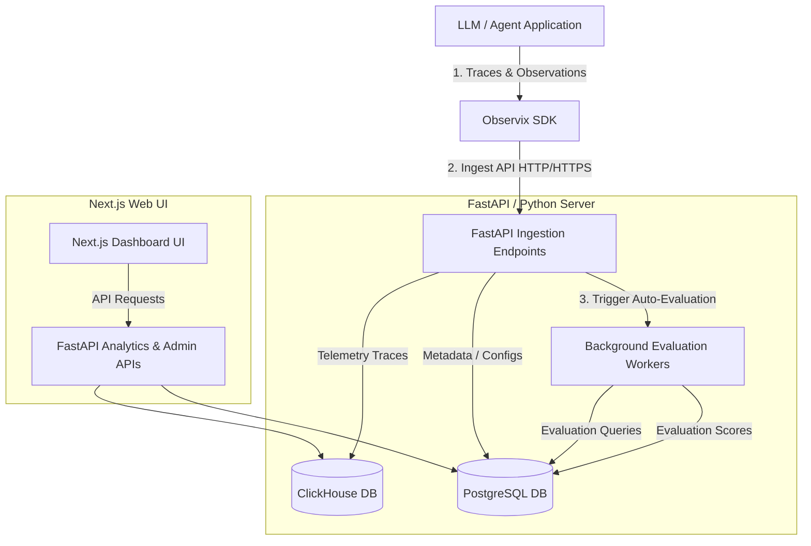

# Observability Application & Observix SDK Functional Documentation

This document outlines all the features and capabilities of the **Observability Application** and the embedded **Observix SDK** submodule. 

---

## 1. System Architecture Overview

The system is a multi-tenant observability and evaluation stack designed specifically for LLM applications and agentic workflows. It is divided into three primary components:
1. **Observix Python SDK**: The client instrumentation library used to trace LLM applications.
2. **Observability Backend**: A FastAPI server running uvicorn that exposes ingestion APIs, analytics aggregations, and background LLM evaluations.
3. **Observability Frontend**: A Next.js (Turbopack) dashboard providing Gantt-chart-style trace visualization, evaluation monitoring, alerting configuration, and analytics charts.

### Architecture Flow Diagram

---

## 2. Observix Python SDK Functionalities

The **Observix SDK** handles telemetry collection, automatic instrumentation, and manual trace generation.

### A. Automatic Instrumentation (Auto-Patching)
File reference: [patches.py](file:///Users/aarora/Dev/research/observix/src/observix/src/observix/patches.py)
*   **Built-in Monkey Patching**: Automatically patches common AI libraries on startup or dynamically when they are imported.
*   **Supported Frameworks**:
    *   **OpenAI & AsyncOpenAI**: Intercepts `Completions.create` and `AsyncCompletions.create` to automatically extract prompts, completions, tokens used, cost, and latency.
    *   **Anthropic & AsyncAnthropic**: Intercepts `Messages.create` and `AsyncMessages.create`.
    *   **Google GenAI**: Intercepts `Models.generate_content` and `AsyncModels.generate_content`.
    *   **LangChain**: Patches `BaseChatModel.invoke`/`ainvoke` and `BaseLLM.invoke`/`ainvoke` to automatically log calls to tools, prompts, and output sequences.

### B. Manual Tracing and Agent Annotations
*   **`@observe` Decorator**: Can annotate any Python function to record execution spans.
    *   `as_agent=True`: Demarcates an agent boundary, mapping it inside multi-agent workflow trees.
    *   `as_tool=True`: Demarcates an tool boundary, mapping it inside multi-agent workflow trees.
*   **SDK API Hooks**:
    *   `capture_context(key, value)`: Attaches contextual metadata to the current span.
    *   `capture_tools(tools)`: Captures definitions, system schemas, and parameters of the tools exposed to an LLM.
    *   `capture_candidate_agents(agents)`: Logs candidate agents in a routing evaluation.
    *   `record_score(name, value, reasoning)`: Log custom user-defined execution metrics or evaluations.
    *   `flush()` / `shutdown()`: Forces immediate synchronization of buffers.

### C. Performance & Multitenancy Exporters
*   **Asynchronous Processing**: Send traces in background batches, preventing application blockages.
*   **Header Context Injection**: Inject user-defined API keys and project contexts to automatically route tracing telemetry to the corresponding tenant workspace in the backend database.

---

## 3. Backend Ingestion & Storage Functionalities

The backend provides high-performance telemetry ingestion pipelines and multi-tenant schema isolation.

### A. Hybrid Storage Architecture
*   **ClickHouse Storage**: Specifically optimized for write-heavy, analytical telemetry. Stores:
    *   `traces`: Flat OpenTelemetry timings, span links, status, duration.
    *   `observations`: Inputs, outputs, metadata JSON, costs, parameters.
*   **Postgres Storage**: Relational engine using SQLModel. Stores:
    *   `User` & `Role` (RBAC authorization details)
    *   `Organization`, `Project`, and `Application` entities
    *   `ApiKey` records (hashed using SHA-256 for secure verification)
    *   `EvaluationRule`, `Metric`, and `EvaluationResult` objects
    *   `AlertRule`, `Alert`, and `NotificationChannel` configurations

### B. Automated Evaluation Triggering
*   Ingesting observations triggers active evaluation rules matching the target `Application` asynchronously

---

## 4. LLM Evaluation Engine

The platform includes a built-in background evaluation pipeline running standard LLM metrics against ingested traces.

### A. Integrated Evaluation Frameworks
*   **Observix Native AI Evaluator**:
    *   **Tool Selection**: Checks if optimal tools were selected for specific prompts.
    *   **Tool Input Structure**: Verifies that tool parameters correspond to the target tool's JSON schema.
    *   **Tool Sequence**: Confirms correct logical ordering of tool invocations.
    *   **Agent Routing**: Validates whether tasks are routed to the proper sub-agents.
    *   **Workflow Completion**: Evaluates if the agent resolved the user query.
    *   **Human-in-the-Loop (HITL)**: Evaluates user correction occurrences.
*   **DeepEval Framework**:
    *   Answer Relevancy, Faithfulness, Context Precision/Recall, Hallucination, Task Completion, Tool Correctness, Toxicity, Bias.
*   **Ragas Framework**:
    *   Faithfulness, Context Precision/Recall, Answer Relevancy, Noise Sensitivity.
*   **Arize Phoenix Framework**:
    *   Hallucination, QA, RAG Relevancy, Agent Function Calling, Toxicity.

### B. Custom & Programmatic Evaluation APIs
*   **Custom Metrics**: Users can define custom criteria (e.g. rubrics and system prompts) through the dashboard UI.
*   **Batch Run Engine**: Re-runs evaluation suites on stored traces or test datasets.

---

## 5. Analytics & Monitoring Functionalities

Exposes rich data aggregations and metrics queries for visual dashboards.

*   **Financial Tracking**: Aggregates token usage (prompt, completion) and projects cumulative costs based on model provider pricing sheets.
*   **Trace Performance Charts**: Queries request throughput, average response latencies, error frequencies, and rate trends over time.

---

## 6. Frontend Web UI Features

An interactive dashboard built with Next.js that facilitates workflow monitoring.

### A. Trace Explorer and Visualizer
*   **Timeline / Gantt View**: Visualizes agent executions and nested sub-agent tool calls.
*   **Interactive Trace Tree**: Lets developers expand/collapse nested spans and identify where failures or bottlenecks occurred.
*   **Observation Inspect Panel**: Shows input prompts, LLM completion payloads, token usage statistics, model parameters, and runtime exception tracebacks side-by-side.

### B. Evaluation Portal
*   **Batch History**: Overview of all batch evaluation iterations, pass rates, average scores, and comparison timelines.
*   **Metric Rules Settings**: Assign automated evaluation rules (e.g., run Toxicity or Tool Correctness metrics automatically on all LLM calls).

### C. Alerts & Notification Channels
*   **Alert Rules**: Create threshold criteria (e.g., alert if latency > 2s, or if average Faithfulness score < 70%).
*   **Notification Routing**: Integrates with notification destinations like Slack channels, Webhooks, PagerDuty, or Email alerts.

### D. Workspace Settings
*   **Provider Credentials**: Configure API keys for OpenAI, Groq, Anthropic, Bedrock, Vertex AI, Google, etc.
*   **API Key Management**: Generate new ingest keys and application tokens to connect new agents.
